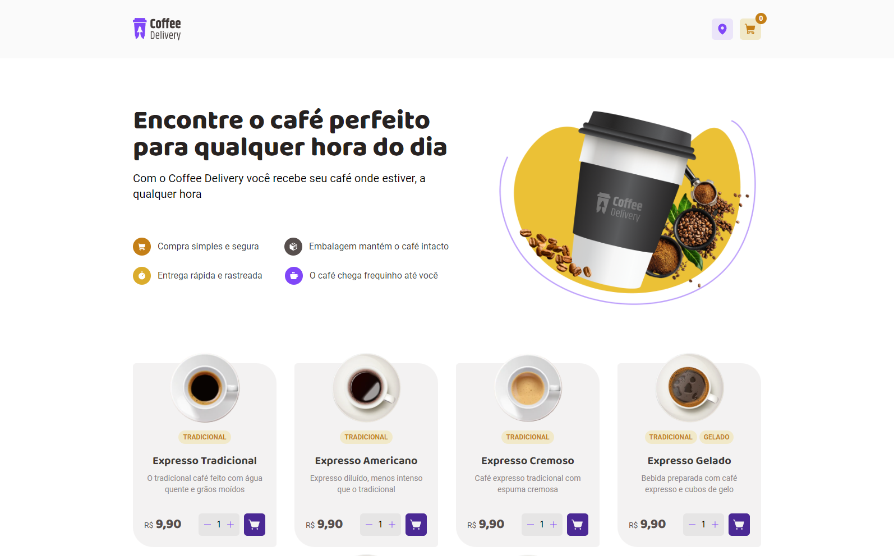

<h1 align="center">Coffee Delivery</h1>

<h2 align="center">The "coffee delivery" is a fictitious store that offer multiple coffee flavors.</h2>

<p align="center">Project created with Vite, ReactJS, Tailwind and Radix-ui.</p>



<br>

<p>On this application, I've used React hook form to handle with controlled and uncontrolled inputs and zod as validation.</p>

## Features

- [x] Select coffee and quantity
- [x] Add and delete product on cart
- [x] Uncontrolled form to insert delivery address
- [x] Controlled form to set payment method

## For run

NPM

```bash
npm install
npm run dev
```

[](https://choosealicense.com/licenses/mit/)
